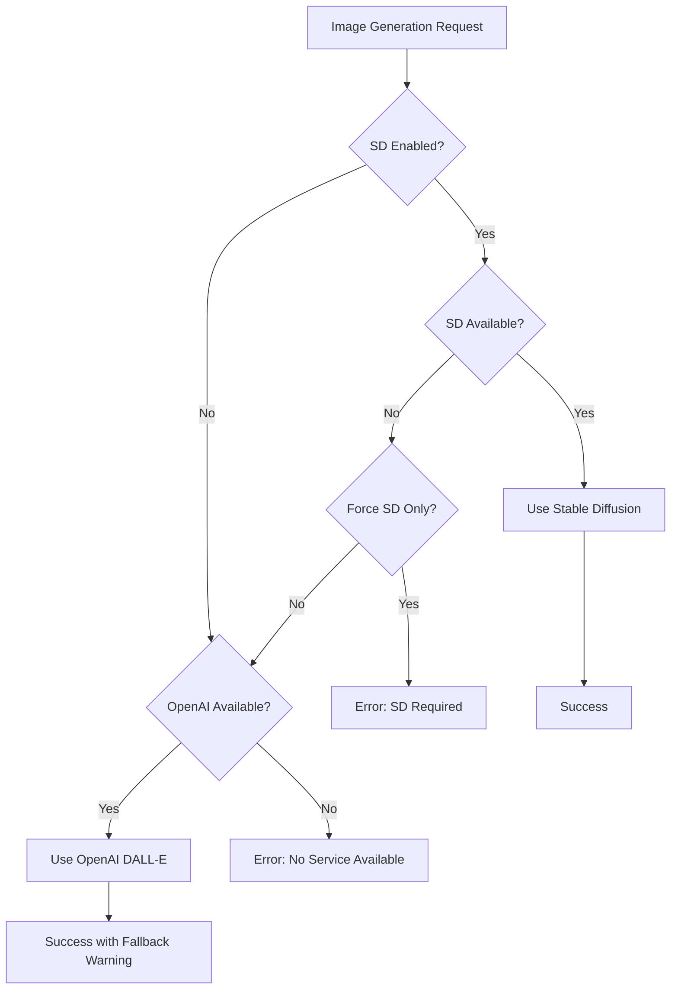

# Image Generation Service Priority System

## Overview

The Jarvis 2.0 chat application **prioritizes Stable Diffusion over all other image generation services**. This document explains the priority system, configuration options, and how to ensure optimal performance.

## Service Priority Order

### 1. 🥇 Stable Diffusion (Local) - PRIMARY SERVICE
- **URL**: `http://localhost:5001` (configurable)
- **Priority**: Highest (Priority Level 1)
- **Advantages**:
  - ✅ Runs locally for complete privacy
  - ✅ No API costs or rate limits
  - ✅ Full control over generation parameters
  - ✅ Supports negative prompts
  - ✅ Custom dimensions and advanced settings
  - ✅ Reproducible results with seeds

### 2. 🥈 OpenAI DALL-E - FALLBACK SERVICE ONLY
- **Priority**: Lower (Priority Level 2)
- **Usage**: Only when Stable Diffusion is unavailable
- **Limitations**:
  - ❌ Requires API key and credits
  - ❌ Limited customization options
  - ❌ No negative prompts
  - ❌ Fixed dimensions

### 3. ❌ Gemini API - NOT USED FOR IMAGE GENERATION
- **Usage**: Text/chat functionality ONLY
- **Note**: Google's Gemini models do not support image generation

## Configuration Options

### Environment Variables

```bash
# Core Stable Diffusion Settings
SD_ENABLED=true                    # Enable/disable Stable Diffusion
SD_SERVER_URL=http://localhost:5001 # Server URL
SD_PRIORITY=1                      # Priority level (1 = highest)

# Advanced Settings
SD_MAX_RETRIES=3                   # Retry attempts before fallback
SD_HEALTH_TIMEOUT=5000             # Health check timeout (ms)
SD_FALLBACK_OPENAI=true           # Allow fallback to OpenAI
SD_FORCE_ONLY=false               # Never use fallback services

# Fallback Service
OPENAI_API_KEY=your_key_here      # Required for DALL-E fallback
```

### Priority Logic Flow



## How to Ensure Stable Diffusion Priority

### 1. Start Stable Diffusion Server
```bash
# Start the local Stable Diffusion server
python src/services/stable-diffusion-server.py
```

### 2. Verify Configuration
```bash
# Test the priority system
npm run test:image-priority
```

### 3. Environment Setup
```bash
# Copy example configuration
cp .env.example .env

# Edit .env file to ensure:
SD_ENABLED=true
SD_PRIORITY=1
SD_FORCE_ONLY=false  # or true to never use fallback
```

## Testing the Priority System

### Automated Test
```bash
npm run test:image-priority
```

### Manual Testing

1. **Test Stable Diffusion Priority**:
   ```bash
   curl -X POST http://localhost:3000/api/image-generation \
     -H "Content-Type: application/json" \
     -d '{"prompt": "a beautiful sunset", "use_stable_diffusion": true}'
   ```

2. **Check Service Status**:
   ```bash
   curl http://localhost:3000/api/image-generation
   ```

### Expected Results

✅ **Correct Behavior**:
- Stable Diffusion is attempted first
- Service logs show "Using Stable Diffusion (Local)"
- Fallback only occurs when SD is unavailable
- Clear logging of service selection

❌ **Incorrect Behavior**:
- OpenAI used when Stable Diffusion is available
- No retry attempts for Stable Diffusion failures
- Missing service priority logs

## Troubleshooting

### Common Issues

#### 1. "Stable Diffusion not available"
**Solution**: Start the Stable Diffusion server
```bash
python src/services/stable-diffusion-server.py
```

#### 2. "Using OpenAI instead of Stable Diffusion"
**Causes**:
- Stable Diffusion server not running
- Health check timeout
- Configuration disabled

**Solution**:
```bash
# Check server status
curl http://localhost:5001/health

# Verify configuration
echo $SD_ENABLED
echo $SD_SERVER_URL
```

#### 3. "No image generation service available"
**Solution**: Configure at least one service
```bash
# Either start Stable Diffusion OR set OpenAI key
SD_ENABLED=true
# OR
OPENAI_API_KEY=your_key_here
```

### Debug Logging

Enable detailed logging to troubleshoot priority issues:

```bash
LOG_LEVEL=debug
```

Look for these log messages:
- `[SD Health] Checking Stable Diffusion health`
- `[Image Generation] Stable Diffusion preference: true`
- `[Service Status] Recommended service: stable_diffusion`

## API Integration

### Chat Tool Usage

The image generation tool automatically prioritizes Stable Diffusion:

```typescript
// Tool call in chat
{
  "tool": "generate_image",
  "parameters": {
    "prompt": "a beautiful landscape",
    "use_stable_diffusion": true  // Default: true
  }
}
```

### Direct API Usage

```javascript
// Prioritize Stable Diffusion (default behavior)
const response = await fetch('/api/image-generation', {
  method: 'POST',
  headers: { 'Content-Type': 'application/json' },
  body: JSON.stringify({
    prompt: "a beautiful sunset",
    use_stable_diffusion: true,  // Explicitly prefer SD
    width: 512,
    height: 512,
    steps: 20,
    guidance_scale: 7.5
  })
});
```

## Performance Optimization

### Recommended Settings

```bash
# For best performance
SD_ENABLED=true
SD_PRELOAD=true          # Slower startup, faster generation
SD_MAX_RETRIES=3         # Balance between reliability and speed
SD_HEALTH_TIMEOUT=5000   # 5 second timeout
SD_FORCE_ONLY=true       # Never use fallback (optional)
```

### Hardware Considerations

- **GPU**: NVIDIA GPU with CUDA support recommended
- **RAM**: Minimum 8GB, 16GB+ recommended
- **Storage**: 10GB+ free space for models

## Summary

The Jarvis 2.0 application is **already configured to prioritize Stable Diffusion** over other image generation services. The enhancements made include:

1. ✅ **Enhanced Configuration**: More granular control over service priority
2. ✅ **Improved Logging**: Better visibility into service selection
3. ✅ **Retry Logic**: Multiple attempts before fallback
4. ✅ **Health Monitoring**: Robust service availability checking
5. ✅ **Validation Tools**: Automated testing of priority system

**Key Point**: Gemini API is NOT used for image generation - only for text/chat functionality. The system correctly uses Stable Diffusion as primary and OpenAI DALL-E as fallback only.
