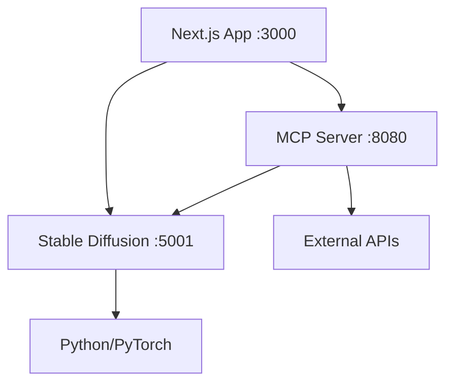

# Jarvis 2.0 - Startup Guide

## Quick Start (One Command)

### Windows
```cmd
start-jarvis.bat
```

### Linux/Mac
```bash
./start-jarvis.sh
```

### Cross-Platform (npm)
```bash
npm run dev:full
```

## Initial Setup

### 1. First Time Setup
```bash
# Run the interactive setup script
npm run setup

# Or manually:
cp .env.example .env
npm install
npm run setup:python
```

### 2. Configure API Keys
Edit `.env` file and add your API keys:
```bash
# Required for chat functionality
API_KEY=your_google_ai_api_key_here

# Optional for image generation fallback
OPENAI_API_KEY=your_openai_api_key_here
```

Get API keys from:
- **Google AI**: https://makersuite.google.com/app/apikey
- **OpenAI**: https://platform.openai.com/api-keys

## Available Startup Commands

### Development Commands

| Command | Description | Services Started |
|---------|-------------|------------------|
| `npm run dev:full` | **Recommended** - Start all services with auto-startup | Next.js + MCP + Stable Diffusion |
| `npm run dev` | Start core services (manual SD startup) | Next.js + MCP |
| `npm run dev:next` | Start Next.js only | Next.js |
| `npm run dev:mcp` | Start MCP server only | MCP |
| `npm run dev:sd` | Start Stable Diffusion only | Stable Diffusion |

### Production Commands

| Command | Description | Services Started |
|---------|-------------|------------------|
| `npm run start:all` | Start all production services | Next.js + MCP + Stable Diffusion |
| `npm run start` | Start Next.js production server | Next.js |
| `npm run start:mcp` | Start MCP production server | MCP |
| `npm run start:sd` | Start Stable Diffusion server | Stable Diffusion |

### Utility Commands

| Command | Description |
|---------|-------------|
| `npm run health` | Check all service health |
| `npm run health:sd` | Check Stable Diffusion health |
| `npm run health:wait` | Wait for Stable Diffusion to be ready |
| `npm run setup` | Interactive setup wizard |
| `npm run setup:python` | Install Python dependencies |
| `npm run setup:cuda` | Install Python dependencies with CUDA |

## Service Architecture

### Services Overview

1. **Next.js Application** (Port 3000)
   - Main web interface
   - Chat functionality
   - Image generation UI

2. **MCP Server** (Port 8080)
   - Tool coordination
   - API routing
   - Service management

3. **Stable Diffusion Server** (Port 5001)
   - Local image generation
   - Python-based service
   - GPU/CPU support

### Service Dependencies



## Troubleshooting

### Common Issues

#### 1. "Python not found"
**Solution**: Install Python 3.8+
```bash
# Windows: Download from python.org
# Mac: brew install python3
# Ubuntu: sudo apt install python3 python3-pip
```

#### 2. "Stable Diffusion dependencies missing"
**Solution**: Install Python dependencies
```bash
npm run setup:python
# Or with CUDA support:
npm run setup:cuda
```

#### 3. "Port already in use"
**Solution**: Check what's using the ports
```bash
# Windows
netstat -ano | findstr :3000
netstat -ano | findstr :5001
netstat -ano | findstr :8080

# Linux/Mac
lsof -i :3000
lsof -i :5001
lsof -i :8080
```

#### 4. "API_KEY not set"
**Solution**: Configure your .env file
```bash
# Edit .env file
API_KEY=your_google_ai_api_key_here
```

#### 5. "Health check failed"
**Solution**: Check service status
```bash
npm run health
```

### Debug Mode

Enable detailed logging:
```bash
# In .env file
LOG_LEVEL=debug
```

### Service-Specific Troubleshooting

#### Next.js Issues
```bash
# Clear cache and rebuild
npm run clean
npm run build
npm run dev:next
```

#### Stable Diffusion Issues
```bash
# Test Python environment
python -c "import torch; print(torch.__version__)"
python -c "import diffusers; print('Diffusers OK')"

# Check GPU support
python -c "import torch; print(f'CUDA: {torch.cuda.is_available()}')"

# Manual start with logs
python src/services/stable-diffusion-server.py
```

#### MCP Server Issues
```bash
# Check MCP server directly
npm run dev:mcp

# Test MCP endpoint
curl http://localhost:8080/health
```

## Performance Optimization

### Hardware Recommendations

#### Minimum Requirements
- **CPU**: 4+ cores
- **RAM**: 8GB
- **Storage**: 10GB free space
- **GPU**: Optional (CPU fallback available)

#### Recommended Setup
- **CPU**: 8+ cores
- **RAM**: 16GB+
- **Storage**: 20GB+ SSD
- **GPU**: NVIDIA GPU with 6GB+ VRAM

### Configuration Tuning

#### For Better Performance
```bash
# In .env file
SD_PRELOAD=true          # Preload model (slower startup, faster generation)
SD_MAX_RETRIES=1         # Reduce retries for faster fallback
LOG_LEVEL=warn           # Reduce logging overhead
```

#### For Development
```bash
# In .env.local file
SD_PRELOAD=false         # Faster startup
LOG_LEVEL=debug          # Detailed logging
SD_HEALTH_TIMEOUT=3000   # Faster health checks
```

## Environment Files

### .env (Main Configuration)
- Production settings
- API keys
- Service URLs
- **Commit to version control**: NO

### .env.local (Local Overrides)
- Development settings
- Local service URLs
- Debug flags
- **Commit to version control**: NO

### .env.example (Template)
- Example configuration
- Documentation
- Default values
- **Commit to version control**: YES

## Security Notes

### API Key Security
- Never commit API keys to version control
- Use environment variables only
- Rotate keys regularly
- Use different keys for development/production

### Local Network Access
- Services bind to localhost by default
- Configure firewall if needed
- Use HTTPS in production

## Advanced Usage

### Custom Service URLs
```bash
# In .env file
SD_SERVER_URL=http://custom-host:5001
MCP_SERVER_URL=http://custom-host:8080
```

### Docker Support (Future)
```bash
# Coming soon
docker-compose up
```

### Cluster Deployment (Future)
```bash
# Coming soon
kubectl apply -f k8s/
```

## Support

### Getting Help
1. Check this documentation
2. Run `npm run health` for diagnostics
3. Check logs in console output
4. Review .env configuration

### Reporting Issues
Include in your report:
- Operating system
- Node.js version (`node --version`)
- Python version (`python --version`)
- Error messages
- Health check output (`npm run health`)

### Useful Commands for Support
```bash
# System information
node --version
python --version
npm --version

# Service status
npm run health

# Configuration check
cat .env | grep -v "API_KEY\|SECRET"
```
